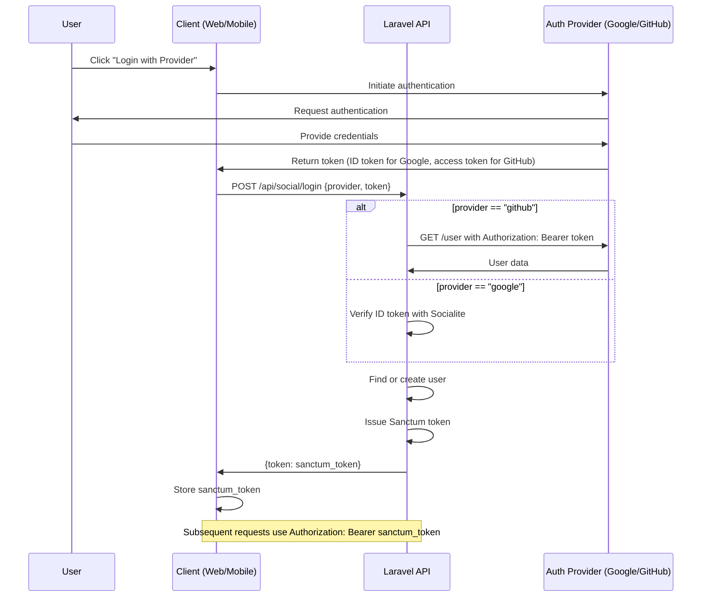

```mermaid
sequenceDiagram
    participant User
    participant Client as Client (Web/Mobile)
    participant API as Laravel API
    participant Provider as Auth Provider (Google/GitHub)

    User->>Client: Click "Login with Provider"
    Client->>Provider: Initiate authentication
    Provider->>User: Request authentication
    User->>Provider: Provide credentials
    Provider->>Client: Return token (ID token for Google, access token for GitHub)
    Client->>API: POST /api/social/login {provider, token}
    alt provider == "github"
        API->>Provider: GET /user with Authorization: Bearer token
        Provider->>API: User data
    else provider == "google"
        API->>API: Verify ID token with Socialite
    end
    API->>API: Find or create user
    API->>API: Issue Sanctum token
    API->>Client: {token: sanctum_token}
    Client->>Client: Store sanctum_token
    Note over Client,API: Subsequent requests use Authorization: Bearer sanctum_token
```